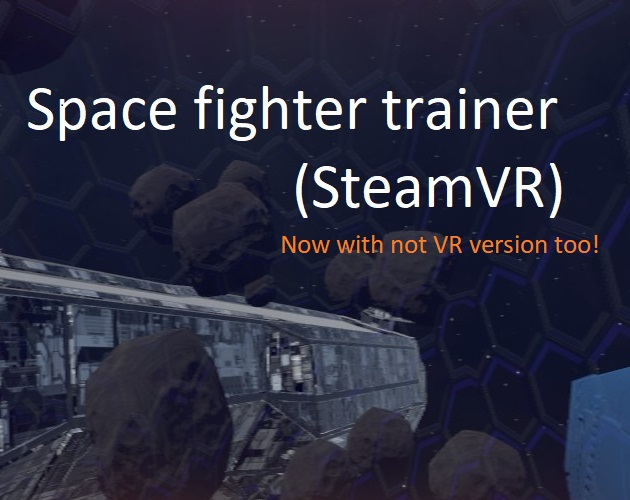
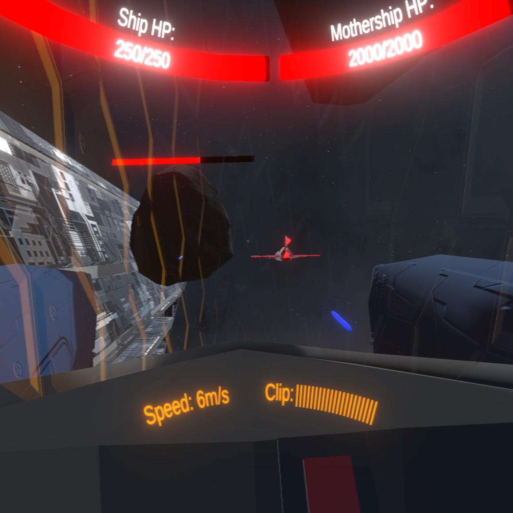
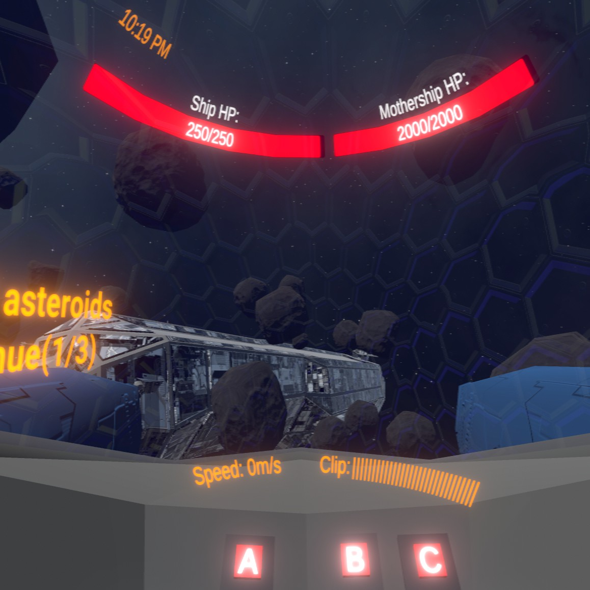
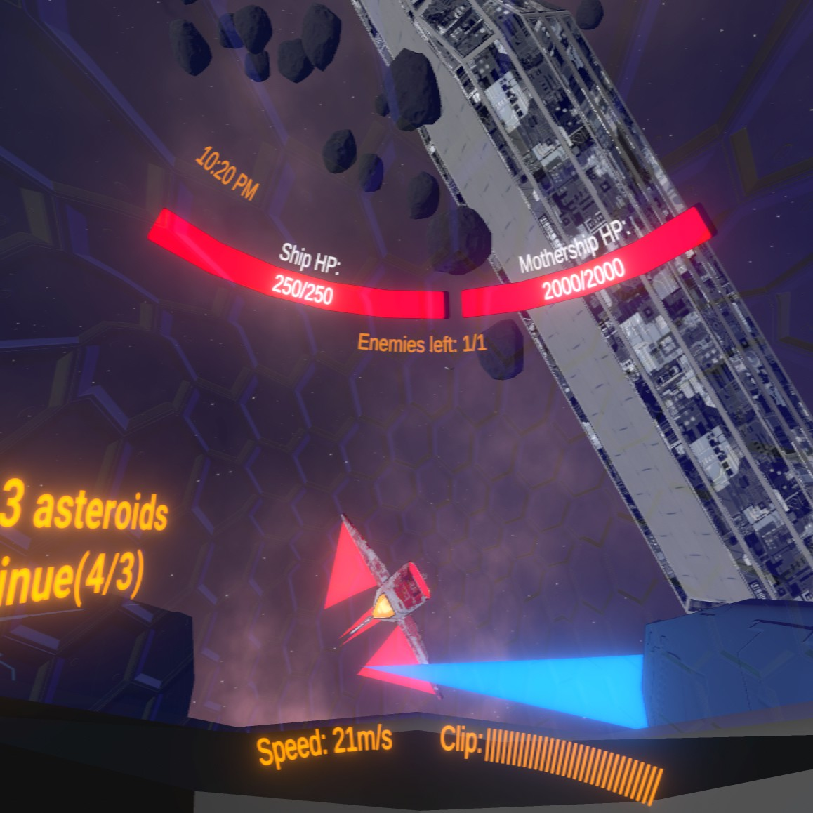
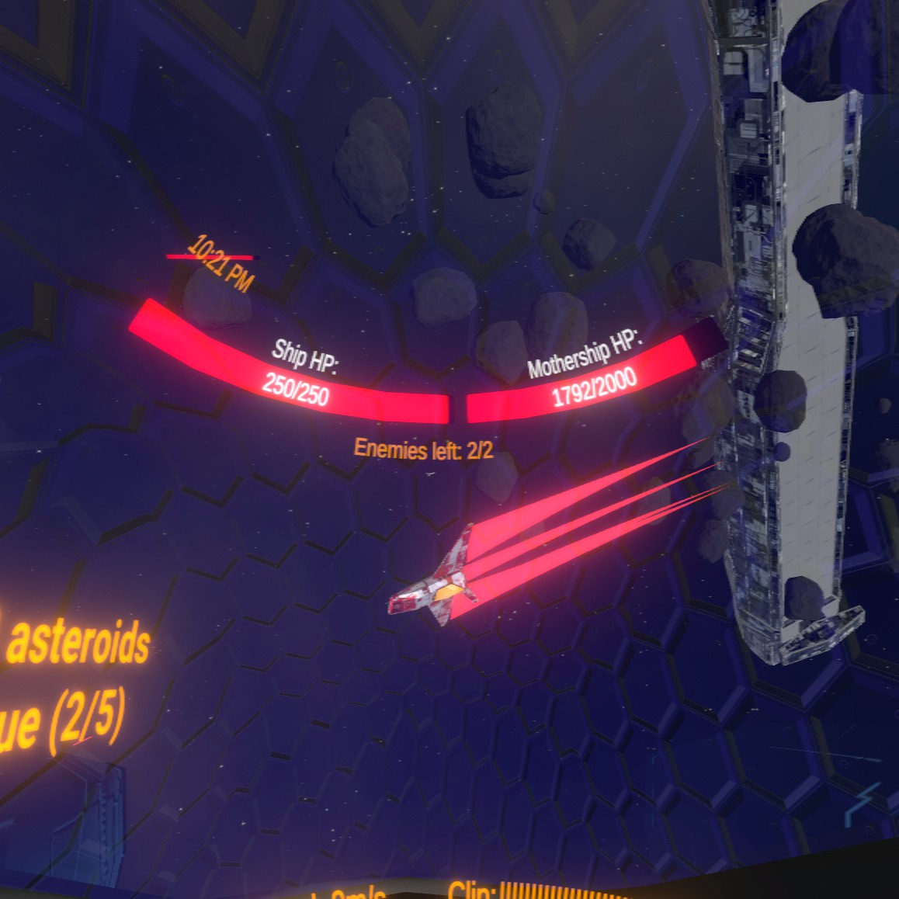

# [Hackgames](https://www.facebook.com/hackgames.in.ua)
Theme: Retro game in VR

  
Space fighter simulator with realistic controls for Hackgames VR jam. Protect mothership from waves of pirates, upgrade between waves and find all 5 easter eggs. Seated playing only.

Containts in-game tutorial. All game in English, it's just trailer with Ukrainian translation.

Requires SteamVR to launch. Tested only with WMR, but I pretty sure that it works with all SteamVR supported headsets.

# Downloads and Links
Available in [Windows, Linux, OSX for Non-VR and Windows for VR](https://teamon.itch.io/space-fighter-trainer). If you encounter any problem, please leave a issue!  

# Hackgames jam?
Local game-jam in Kiev, running by Murka few times per year

# Tools
 * Unity 2019.3.9f1
 * Visual Studio 2019
 * Blender

# Credits
 * [Team-on](https://github.com/Team-on) - programmer
 * [Long-as-Python](https://github.com/Long-as-Python) - programmer
 * [durnevigor](https://sketchfab.com/durnevigor) - 3d artist

# Screenshots
  
  
  
  
